## 介绍
本实验针对0/1背包问题，利用动态规划算法，回溯算法和分支限界算法，对Florida State University和Unicauca University两种0/1背包问题数据集进行求解，其中动态规划采用二维数组和元组两种方式存储，回溯法采用了限界函数的形式来优化计算步骤，分支限界法则采用LC-优先级队列的方式。

## 流程图


## 目录结构
```shell
.
├── .gitignore  # git忽略文件
├── bin  # 二进制文件目录
│   ├── bb  # 分支限界
│   ├── bb_double  # 分支限界（数据不为整数）
│   ├── bt  # 回溯法
│   ├── bt_double  # 回溯法（数据不为整数）
│   ├── dp  # 动态规划
│   ├── dp_double  #（无法使用）
│   ├── dp_tuple  # 动态规划元组法
│   └── dp_tuple_double  # 动态规划元组法（数据不为整数）
├── build  # 构建目录
├── CMakeLists.txt  # CMake文件
├── include  # 头文件目录
│   ├── knapsack.h  # 背包类
│   └── utils.h  # 多文件编译共享的变量和函数
├── main.cpp  # 主函数
├── README.md  # 说明文件
├── res  # 资源文件目录
├── src  # 算法源码目录
│   ├── bb.cpp  # 分支限界算法
│   ├── bt.cpp  # 回溯法
│   ├── dp.cpp  # 动态规划
│   └── dp_tuple.cpp  # 动态规划元组法
├── data  # 数据集目录
│   ├── FSU  # Florida State University数据集
│   ├── large_scale  # Unicauca University数据集（大规模）
│   ├── large_scale-optimum  # Unicauca University数据集最优解
│   ├── low-dimensional  # Unicauca University数据集（小规模）
│   └── low-dimensional-optimum  # Unicauca University数据集最优解
└── test  # 测试目录
    ├── test.bat  # Windows测试文件
    └── test.sh  # Linux测试文件
```

## 构建
### 配置要求
- CMake>=3.8
- 编译器完整支持C++17标准
- 头文件库包含`unistd.h`

### 编译
首先进入项目目录，然后执行以下命令进行构建和编译：
```shell
cmake -S . -B build
cmake --build build
```
如果需要测试数据为非整数，请使用以下命令进行构建和编译：
```shell
cmake -S . -B build -D DOUBLE=ON
cmake --build build
```
构建的输出目录为[build](build)，编译出的可执行文件的输出目录为[bin](bin)。

## 测试

### 参数说明
数据集A（UU数据集）：`<algorithm_name> -q <file_question> [-o <file_optimum>]`

数据集B（FSU数据集）：`<algorithm_name> -n <count> -c <file_capacity> -w <file_weight> -v <file_value>} [-s <file_selection>]`

### Windows 批量测试
执行[test/test.bat](test/test.bat)文件即可。

### Liunx 批量测试
执行[test/test.sh](test/test.sh)文件即可。
